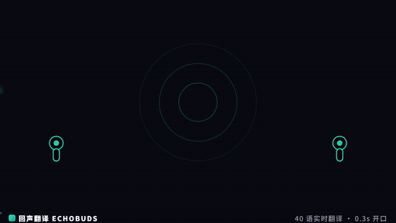
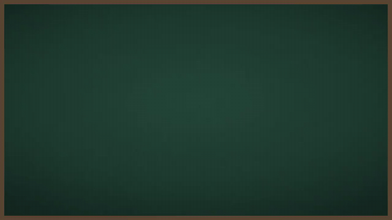
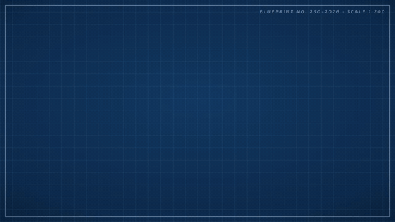
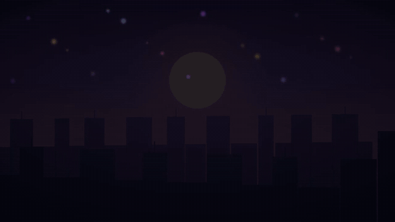

# anything2video

**给一个主题/产品/品牌，产出一条 Remotion 代码动画视频的统一入口。** 任意类型视频都从这进：宣传片、广告、产品介绍、品牌片、讲解视频——画面由「配方」驱动，每一帧都是代码绘制，多 agent 并行生产，带完整的 QC 探针与验收判据。

> **English TL;DR**: `anything2video` is an agent skill (Claude Code / ZCode / any harness that can dispatch subagents) that turns a topic, product, or brand into an original, code-drawn Remotion video — promo, ad, product intro, or explainer. Type-specific "recipes" define the storyboard skeleton, duration tiers, pacing, aesthetics and brand-color discipline. It ships a compilable Remotion 4 template (motion-graphics primitives, TTS / storyboard / render tooling), a multi-agent orchestration protocol, quantitative QC probes, and worked example videos. Docs are in Chinese; the workflow itself produces videos in Chinese or English.

[](LICENSE)


## 成片样例

全部画面由 Remotion 代码绘制（无素材拼接、无生图管线），完整成片见 [`examples/`](examples/)：

| promo 宣传片 | custom 粉笔黑板 | custom 工程蓝图 | custom 霓虹夜城 |
|---|---|---|---|
|  |  |  |  |

黑底 MG 讲解片（3–5 分钟科普长片）的完整参考实现（调研 → 解说词 → 分镜 → 镜头源码 → QC 报告 → 成片参考帧）内置于 [`reference/explainer/sample-rag/`](reference/explainer/sample-rag/)。

## 核心思想

1. **每帧都是代码**：画面全部由 Remotion/React 代码绘制，不拼接素材、不走生图管线——原创可审计，改一处参数全片联动。B-roll 只允许免版权来源并登记 MANIFEST。
2. **配方驱动**：本 skill 不写死任何视觉体系，`recipes/` 下每种视频类型一份完整生产规范（分镜骨架、时长档、节奏、审美、品牌色纪律、可判定 QC 判据）。类型决定配方，配方决定一切。
3. **多 agent 并行**：调研、文案、分镜、并行建组、渲染、QC、修复是一条编排好的流水线——每组 5–7 个镜头并行派工，一个 45–60s 宣传片从开工到成片约 1–2 小时（agent 时间）。
4. **QC 有探针**：不信「看起来没问题」。字幕窗口落点、动画活性、空场、单帧耗时、主体尺寸对账都有独立探针脚本（`probe_time` / `probe_liveness` / `probe_blank` / `probe_frame_cost` / `probe_subject`），量化判据逐条 pass/fail，修复轮收线标准：高 0 / 中 0 / 低 ≤5。

## 三种配方

| 你要的 | 配方 | 说明 |
|---|---|---|
| 宣传片 / 广告 / 产品介绍 / 品牌片 | [`recipes/promo.md`](recipes/promo.md) | **主战场**：钩子 → 卖点 ×2–3 → 证明 → CTA 骨架；15–90s 三档；品牌色纪律 + 关键词大字 + 快节奏动效 |
| 讲解视频 / 科普 / 文章改视频 | [`recipes/explainer.md`](recipes/explainer.md) | 黑底 MG + 配音 + 字幕 + 章节进度条；规范内联自姊妹项目 [anything2explainer](https://github.com/Vincentwei1021/anything2explainer)（[`reference/explainer/`](reference/explainer/)） |
| 风格即卖点（沙画 / 粉笔 / 蓝图 / 霓虹…） | [`recipes/custom.md`](recipes/custom.md) | 图纸先行（风格图元库先建先过审）+ 开源图标骨架铁律 + 三层混音；参考 `examples/` 三种风格样片 |

## 快速开始

### 0. 环境要求

- Node.js ≥ 18、npm
- ffmpeg（配音混音、渲染走它的编解码）
- Python 3（分镜渲染 / TTS / 帧指标脚本；TTS 可选装 `edge-tts`，英文可选 kokoro）

### 1. 先看模板演示（1 分钟）

```bash
cd template
npm install
npm run studio        # Remotion Studio：看 PromoDemo 宣传片演示合成与 G1–G8 组预览
```

### 2. 建一个新项目

```bash
template/scripts/new_project.sh my-first-video   # 默认落 ~/a2v-projects/my-first-video
# 或指定目录： template/scripts/new_project.sh /path/to/dir my-first-video
```

脚本复制模板、按 slug 改 `src/config.ts`、`npm install` 并跑 `tsc` 验证。

### 3. 作为 agent skill 使用（推荐）

本仓本质是一个 **agent skill**：把仓库（或其内容）挂载为你的 agent 运行时的 skill——

- **ZCode / Claude Code**：放入 skill 目录（如 `~/.agents/skills/anything2video`，Claude Code 用 junction/软链挂载），入口 `SKILL.md`；用户说「给 X 做一条宣传片」即自动路由进本 skill。
- 执行时 agent 按 `SKILL.md` 的八阶段流程走：调研 → 文案 → 分镜 → 并行建组 → 渲染 → QC → 修复 → 交付；派单模板、QC 判据、渲染命令全在 [`reference/workflow-orchestration.md`](reference/workflow-orchestration.md)。
- 没有多 agent 环境也能单 agent 顺序执行（慢，但判据与产物结构完全一致）。

### 4. 手动跑通一条最小片子

不走 agent 编排时：改 `template/src/config.ts`（标题/配方/语言）→ 写 `script/narration.txt`（一行一句）→ `python3 template/scripts/tts_build.py` 出配音与时间轴 → `scripts/preview.sh 5` 渲前 5 秒确认 → `VER=v1 scripts/render.sh` 出整片。

## 生产流程（八阶段）

```
阶段 0 建项目 ──► 1 调研(1 agent) ──► 2 文案+配音+选BGM ──► 3 分镜 ──► 4 覆盖层与图元
                                                                        │
交付 ◄── 8 交付说明+lessons回填 ◄── 7 QC(逐章)与修复轮 ◄── 6 渲染+帧指标 ◄── 5a G1打样 → 用户确认
                                                                    └──► 5b 其余组并行建组(每波3–4 agent)
```

四个用户确认点（配方各自有差异表）：① 类型/时长/语言与字幕 ② 解说词定稿（配音前，最便宜的干预点）③ 配音与 BGM 偏好 ④ 打样（G1 完工后渲前 5–30 秒定风格）。

## 质量体系

- **逐条可判定的 QC 判据**：promo 12 条 / explainer 11 条（节拍帧偏差、字幕遮挡、事实对账、品牌色 ≤3、闪烁白名单计数、构图与光量化、序列活性、主体尺寸对账……），每条给阈值与核对方法，QC agent 逐条出 pass/fail。
- **五个探针脚本**（渲染前静态审计 + 渲染后量化）：类型检查全绿 ≠ 画面成立——`probe_time` 抓时间窗越界、`probe_liveness` 抓动画已死、`probe_blank` 抓渲染静默失败、`probe_frame_cost` 抓单帧性能塌方、`probe_subject` 抓分镜表与实渲染不符。
- **踩坑即回填**：每条真实返工记「现象 → 根因 → 判据/修法」进 [`reference/lessons.md`](reference/lessons.md) 并同步修文档——本仓 QC 体系就是这么长出来的。

## 目录结构

```
anything2video/
├── SKILL.md                      # skill 入口：何时用/配方选择/硬性原则/确认点/八阶段流程
├── recipes/                      # 配方：promo.md / explainer.md / custom.md + _schema.md（配方契约）
├── reference/
│   ├── workflow-orchestration.md # 多 agent 派单协议（阶段表/prompt 模板/修复轮规则/渲染命令）
│   ├── promo-style-guide.md      # promo 审美细则（排版/节奏/转场词汇/品牌色纪律）
│   ├── brand-assets.md           # 品牌资产包解析
│   ├── opus55-cases.md           # 可选外部对标库导读（缺失自动跳过）
│   ├── lessons.md                # 踩坑与根因（实时回填）
│   └── explainer/                # 黑底 MG 讲解片规范全套（内联自 anything2explainer，含参考实现）
├── template/                     # 可编译 Remotion 4 工程
│   ├── src/common|ui|fx|overlay|recipes|shots   # 图元库/光效/覆盖层/配方引擎/示例镜头
│   ├── scripts/                  # tts_build / render_storyboard / mix_audio / frame_metrics / probe_* / new_project
│   └── public/fonts/             # 四款 OFL 字体（含许可）
├── examples/                     # 成片样例（mp4 + GIF）与素材署名
└── docs/audit.md                 # 验收体系审计记录（QC 探针的设计依据）
```

## 相关项目

- [anything2explainer](https://github.com/Vincentwei1021/anything2explainer) —— 黑底 MG 讲解片（本 skill explainer 配方的规范上游）；两项目同源，本仓内联了其核心文档。
- awesome-opus-5-5-videos —— 代码绘帧公开案例的对标库（1000+ 条），暂未公开；`reference/opus55-cases.md` 是它的导读，没有这份库时流程自动跳过对标。

## License

代码与文档以 [MIT](LICENSE) 发布；`template/public/fonts/` 内字体为 SIL OFL 1.1（见该目录 `LICENSE.md`）；`examples/` 样片中的 BGM 来自 Kevin MacLeod (incompetech.com)，CC BY——署名清单见 [examples/README.md](examples/README.md)。
