# anything2video

把主题、文章或产品做成原创视频的 Agent Skill。包含调研、稿件、配音、分镜、代码动画、渲染、审片与修复流程，适配 Claude Code、Codex、豆包工作、WorkBuddy、ZCode 和 MiniMax Code 等具备文件与命令执行能力的助手。

看过一条有材质、镜头推进和首尾呼应的 AI 视频后，很容易产生一个判断：只要换成同一个模型，再抄一条提示词，就能得到同等作品。实际动手往往得到另一种结果：标题很大，字幕很密，背景很炫，信息却没有被解释。anything2video 把调研、写稿、分镜、配音、代码镜头、渲染和审片串成工程，让制作经验沉淀在工程里，而不是寄托在一次临场回答上；你仍然需要能完成任务的模型，但不必把每个导演决定都绑在某个模型上。

**当前 v4.1.0。下载一份通用 ZIP，解压后一条命令装进任意宿主；或克隆仓库直接安装。** 六端共用相同的配方、图元、模板和生产脚本。豆包工作导出完整包手工导入，WorkBuddy 安装到本机技能目录重启发现，接入边界与未知项见 [reference/desktop-hosts.md](reference/desktop-hosts.md)。导演方法、原生画幅、多点打样与证据门禁帮助稳定制作；Skill 不改变模型权重，不承诺全面等价于 Opus 或一次提示生成精品。代码承担精确信息，审核后的生成素材承担场景，逐件登记来源和披露。

English: A portable agent skill for producing researched, original code-composited videos with narration, shot contracts, deterministic rendering and measured quality evidence. Model capabilities and application support still need real validation.

## 快速开始

需要 Node.js、npm、uv、ffmpeg/ffprobe 和可用 Chromium。Remotion 相关包固定同版本，依赖与字体、素材各有许可。

```powershell
git clone https://github.com/2021291696/anything2video.git
cd anything2video
node scripts/doctor.mjs
node scripts/init.mjs D:/video-projects/my-video my-video
cd D:/video-projects/my-video
npm install
uv sync
npx remotion browser ensure
```

初始化器只建模板工程，不产生完整片子；拒绝覆盖非空目录，不自动暂存/提交。工程必须在skill外。浏览器可用环境变量 `BROWSER_EXECUTABLE` 指向已安装版本。

也支持 `node scripts/init.mjs <slug>`：根目录优先 A2V_DATA_ROOT，再读 ~/.anything2video/workdir 的绝对路径；未知时先询问，不默默落在当前目录。首次使用还会同轮问一次**可选的生图 API key**（MiniMax 或任意 OpenAI 兼容接口）：只用于 AI 材质/世界底画面（主要 epic 配方），**对成片约 5%–10% 的效果影响，不填不影响渲染、配音、音乐与交付**；决定（provider 或 none）存 `~/.anything2video/image-channel`，密钥只走环境变量 `A2V_IMAGE_*`、不落盘。音乐默认试听圈选，已指定无音乐或授权选曲则记录决定；风格拿不准先看 [离线视觉样片](samples/index.html)。

## 装进你的助手

```powershell
node scripts/install.mjs claude-code
node scripts/install.mjs zcode
node scripts/install.mjs codex
node scripts/install.mjs minimax-code
node scripts/install.mjs workbuddy
node scripts/install.mjs doubao-work --export-dir D:/a2v-desktop-packages
```

默认用户级安装，已有目录会被保护，更新先备份。前五种可追加项目根参数；MiniMax 可用 `--data-dir <真实DATA_DIR>`，不要传 skills 子目录。WorkBuddy 安装进 `~/.workbuddy/skills/`（本机实证的桌面技能目录），重启应用后核对发现。豆包工作没有已核实的自动发现目录，`--export-dir` 只导出完整包供手工导入，不写宿主配置。

- Claude Code：`.claude/skills/anything2video-claude-code/`，新会话 `/anything2video-claude-code`。
- Codex：`.agents/skills/anything2video-codex/`，新会话 `$anything2video-codex`。
- ZCode：`.agents/skills/anything2video-zcode/`，用 `zcode skills list --json` 核对实际路径；普通 CLI 和可选 workflow 均可。
- MiniMax Code：`{{DATA_DIR}}/skills/anything2video-minimax-code/`，下一会话原生 skill 加载核对 Location。
- WorkBuddy桌面：`~/.workbuddy/skills/anything2video-workbuddy/` 安装后重启核对；CodeBuddy IDE/CLI项目用 `.codebuddy/skills/anything2video/`，入口依版本核对。
- 豆包工作：在可访问本地文件的工作任务中授权导出目录并显式读入口；原生导入格式未核实，不猜路径。

安装后，先要求助手说明它实际读取的入口路径、配方和可执行工具。不要仅凭它说"已经加载"就认为渲染可用。无法执行Shell的聊天环境可以帮你写稿和分镜，但不能交付一个实际渲染好的MP4。

[Releases](https://github.com/2021291696/anything2video/releases) 提供一份通用 ZIP（v4.1.0）：公共核心加全部六个宿主入口，**不含样片媒体**。解压后在目录内运行 `node scripts/install.mjs <宿主>`，按上表装进对应宿主；也可直接把它当克隆仓库使用初始化工程。自建：`node scripts/build-editions.mjs <仓库外输出目录> --generic`（加 `--overwrite` 可重建；六份专属包用不带 `--generic` 的原命令）。安装器现场组装宿主入口并核对 edition.json 哈希清单。

完整说明与验证等级见 [docs/adapters.md](docs/adapters.md)。包检查、工程渲染和应用端完整制作分别记录，安装指南不等于全平台实测认证。

## 能替代什么，不能证明什么

这套方法可以迁移常见的代码视频工作：知识讲解、软件流程动画、产品宣传、风格化叙事和一些品牌片。原先交给某个高端模型的规划与编码，可以交给其他有相应执行能力的助手，再用同样的门禁验收。它没有证明任何模型在理解、编码、审美或长任务稳定性上彼此等同，也不能保证首次成片达到参考片水平；一个代理看不懂源码或没有渲染环境，Skill 无法补出这些能力。没有对照实验，就不声称模型替代率、成本节省比例或质量分数。更实际的目标是：同一条任务书、同一份镜头合同、同一套验收，让换工具后的输出仍然可以判断、追责和修复。

入口 `SKILL.md` 决定该读哪个配方；`recipes/` 给出叙事结构；`reference/` 给出运动、构图、声音和审片规则；`template/` 是 Remotion 工程；`styles/` 保存可复用风格资产；`scripts/` 提供安全初始化、覆盖检查和渲染入口。工作链是：

```text
主题与资料 → 可核实稿件 → 真实配音时间轴 → 镜头合同
           → 小样 → 全片代码 → 三轮验收 → 视频与可复现工程
```

Remotion 把 React 组件按指定帧渲染成视频，因此文字、数字、图示和运动可以精确控制。对于复杂材质，可以把有来源、经过审核的生成素材作为世界底；所有精确信息仍由代码绘制。混合路线必须披露，不能把"画面由代码合成"写成"所有像素都没有外部素材"。

## 从任务书到成片

从一个短而清楚的主题开始，例如缓存。任务书不越长越好，它要约束受众、学习目标、平台、时长和验收：

```text
先完整读anything2video的SKILL.md和production-contract.md。
为刚入门的开发者解释缓存命中和未命中。
发布平台抖音，中文旁白，原生1080x1920，约2分钟。
观众看完应能判断一个请求什么时候读数据库。
每个镜头要有信息变化，使用一个请求对象贯穿演示。
先核实事实，再写稿；所有文字、数字和图解由代码绘制。
我授权你选择音色、视觉方向和音乐；记录你的决定。
先验开场、复杂中段和结尾，至少三轮审片再交付。
提供MP4、工程、字幕、封面、素材来源与ffprobe规格。
没有子代理就顺序完成，不跳过混音和QC。
```

缺少学习目标时，模型容易把"缓存是什么"写成概念列表；有了目标，镜头就能围绕请求移动、命中返回、未命中读取来设计。

**稿件与镜头合同**：先核实事实，后写口播，一行一句，过长字幕用 `|` 切块。配音决定真实句长，不能先硬写两分钟分镜、最后再把语速拉快硬塞进去。TTS 输出清洁的 `audio_narration.wav`，混音输出 `audio.wav`，两者用途不同，反复混音必须保持正本哈希不变。`storyboard.json` 使用1起含端点帧号：

```json
{
  "shots": [
    {
      "id": "S01",
      "from": 1,
      "to": 180,
      "group": "G1",
      "component": "src/shots/Request.tsx",
      "purpose": "建立请求与缓存的关系",
      "action": "请求对象沿路径进入缓存"
    }
  ],
  "claims": [],
  "assets": []
}
```

真实工程需要全部镜头连续覆盖总帧数。Remotion帧号从0开始，Sequence的from应是镜头from减1；漏镜头或错换算会产生空场与音画偏差。

**怎样接近高质量参考片**：最值得借鉴的是结构——有一个贯穿对象，它在每章做事；每章有明确材质世界；首尾有呼应；字幕给画面留空间；运动有起因、过程和落点。软件教程的贯穿对象可以是一枚请求、一份文件或一个制作模块，从输入走向输出。每个镜头问三件事：它承载哪个知识点？哪件事在变化？观众最终看到了什么结果？"标题淡入、背景慢推"可以用在章节呼吸段，但不应成为全部镜头的动作。需要质感时，生成素材负责有机材质，代码负责准确内容；素材必须检查乱字、伪铭文、透视和形态错误，不合格就改构图、换素材或简化视觉，不把伪影藏在模糊和暗角里。

## 配方与资产

讲知识：`recipes/explainer.md`；卖功能：`promo.md`；风格化叙事：`custom.md`；谱系/品牌历史：`epic.md`。旧配方里的宿主、授权、画幅和音频口径统一由 [production-contract](reference/production-contract.md) 覆盖。explainer参考已随仓库附在 `reference/explainer/`，不依赖本机另一个skill目录。

61张套餐卡（v4.1.0 套餐池）：sand、chalk、blueprint、neon、pixel-arcade、paper-collage、swiss-print、crt-terminal、deep-space、mg-purple、epic-paper，轴 D 八卡 guofeng-scroll、paperclip-sticker、hanazi-916（9:16 竖屏原生）、aurora-glass、line-art、isometric-city、morph、liquid-flow，及 v3.8–v4.0 吸收的 amphora、blue-period、candle-light、cave-wall、chrome-ball、clay-town、cumulus-light、dance-line、dot-infinity、facets、gold-leaf、gold-robe、grain-flat、hard-light、hypnotic、ink-boil、ink-plate、ink-tea、kinetic-type、light-dabs、lily-pond、math-lab、mosaic、optical-dots、pop-comic、pop-dot、popup-book、riso-print、rubberhose、scream-warp、sfumato、shadow-play、soft-clock、soft-jelly、studio-oneshot、swirl-oil、target-lock、tomb-wall、vhs-outrun、watercolor-cel、whiplash-line、whiteboard。每卡含图元、SPEC和回归样张；同风格后续片优先复用。材质场景参考在 `reference/materials.md`，混合素材纪律在 `ai-frame-sop.md`。

### 风格样片：点缩略图直接播放

每段 12-20 秒（史诗双卡为 20 秒三幕旗舰）、1280×720（花字卡竖屏）、30fps、带完整音频（TTS 旁白+音效+BGM），套餐制逐卡样片——卡的类型骨架 × 卡的风格视觉（封面为各片第 2 帧实测抽取）。点击缩略图在 GitHub 内嵌播放器中播放；clone 后也可打开离线放映页 [samples/index.html](samples/index.html) 与全量页 [samples/all.html](samples/all.html)。**样片只存在仓库 samples/ 中，安装 ZIP 不含样片媒体。**

|  |  |  |  |
| :---: | :---: | :---: | :---: |
| <a href="samples/sand-sample.mp4" title="播放沙画样片">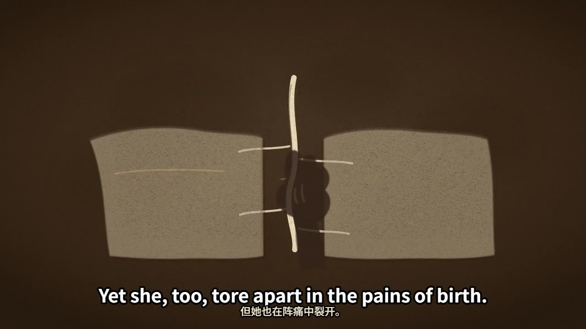</a><br>**沙画** `sand`<br>沙粒与轮廓逐步成形 | <a href="samples/chalk-sample.mp4" title="播放黑板样片">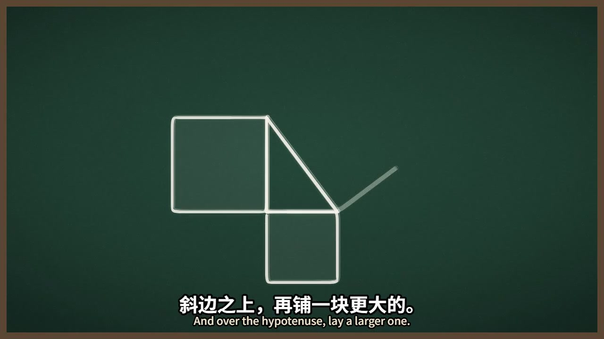</a><br>**黑板** `chalk`<br>笔触与几何推导 | <a href="samples/blueprint-sample.mp4" title="播放蓝图样片"></a><br>**蓝图** `blueprint`<br>结构线稿与尺寸标注 | <a href="samples/neon-sample.mp4" title="播放霓虹样片"></a><br>**霓虹** `neon`<br>辉光与能量路径 |
| <a href="samples/pixel-arcade-sample.mp4" title="播放街机样片">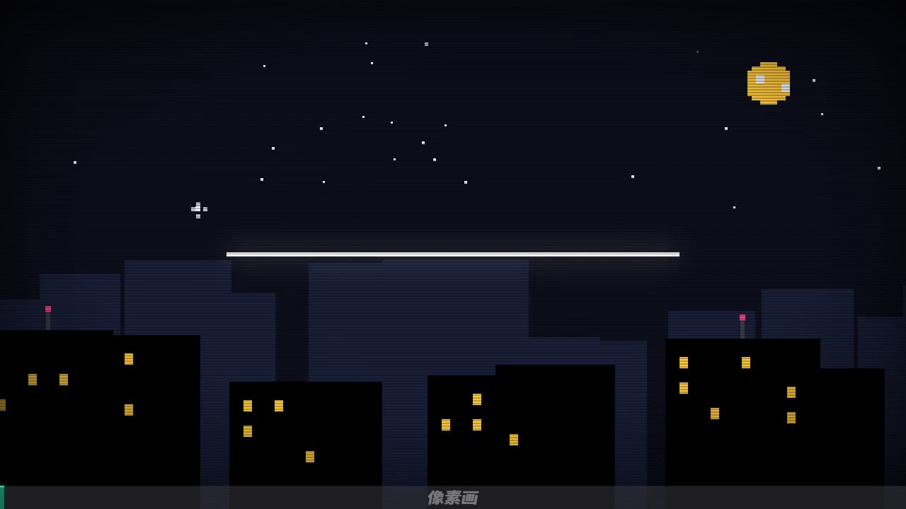</a><br>**街机** `pixel-arcade`<br>像素图形与游戏机语法 | <a href="samples/paper-collage-sample.mp4" title="播放拼贴样片">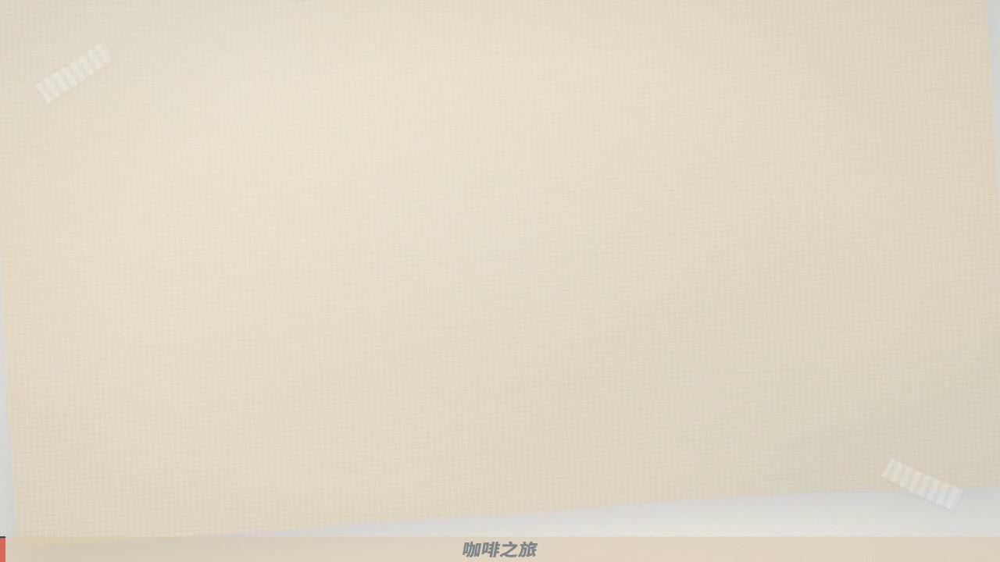</a><br>**拼贴** `paper-collage`<br>撕纸边缘与分层拼贴 | <a href="samples/swiss-print-sample.mp4" title="播放版式样片">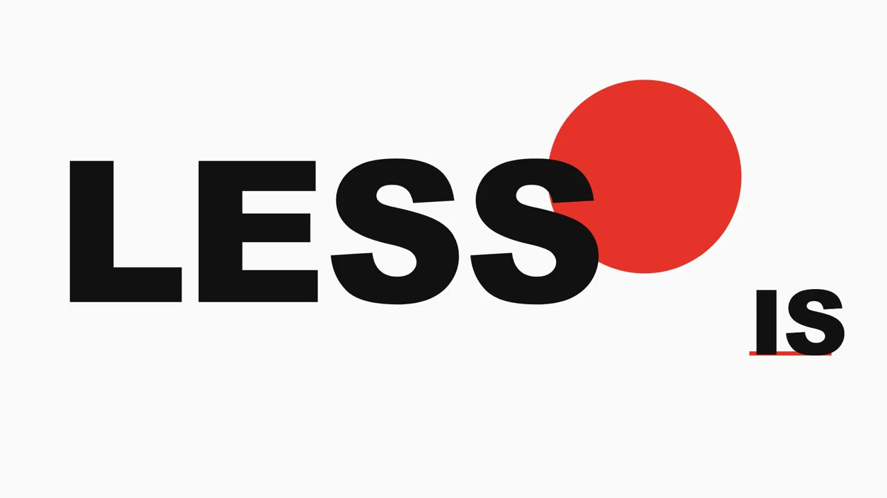</a><br>**版式** `swiss-print`<br>网格与红黑字形 | <a href="samples/crt-terminal-sample.mp4" title="播放终端样片">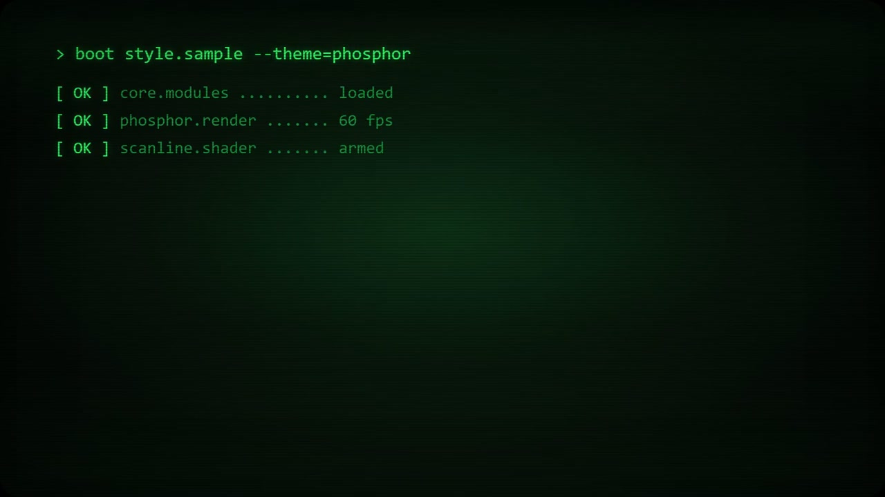</a><br>**终端** `crt-terminal`<br>磷光扫描线与命令行 |
| <a href="samples/deep-space-sample.mp4" title="播放深空样片">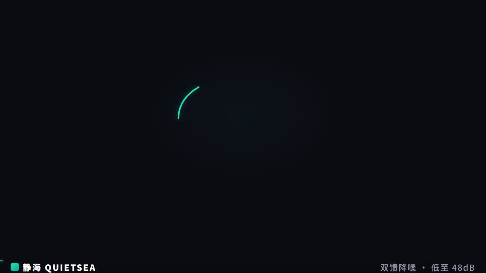</a><br>**深空** `deep-space`<br>星尘黑底与电光青 | <a href="samples/mg-purple-sample.mp4" title="播放夜航样片">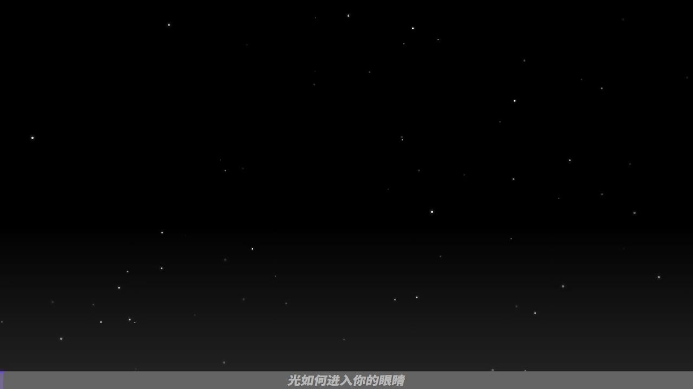</a><br>**夜航** `mg-purple`<br>紫调 HUD 讲解 | <a href="samples/epic-paper-sample.mp4" title="播放神话样片"></a><br>**神话** `epic-paper`<br>暖纸描金与年代轴 |  |
| <a href="samples/guofeng-scroll-sample.mp4" title="播放月窗样片"></a><br>**月窗** `guofeng-scroll`<br>黑底月窗与朱印题跋 | <a href="samples/paperclip-sticker-sample.mp4" title="播放贴纸人样片">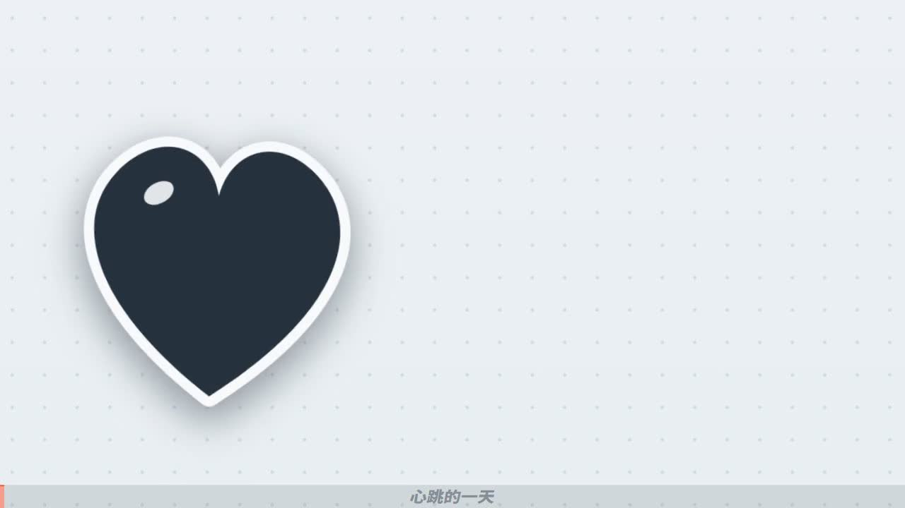</a><br>**贴纸人** `paperclip-sticker`<br>贴纸科普与图解 | <a href="samples/hanazi-916-sample.mp4" title="播放花字样片">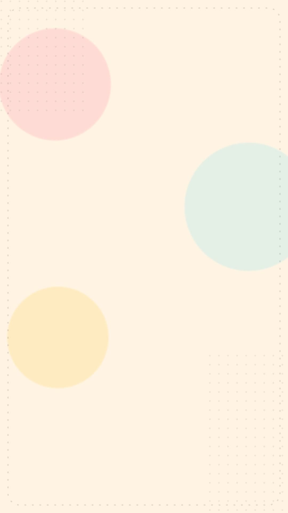</a><br>**花字** `hanazi-916`<br>9:16 竖屏综艺花字 | <a href="samples/aurora-glass-sample.mp4" title="播放玻璃样片"></a><br>**玻璃** `aurora-glass`<br>弥散渐变与玻璃拟态 |
| <a href="samples/line-art-sample.mp4" title="播放线条样片"></a><br>**线条** `line-art`<br>一笔画线条生长 | <a href="samples/isometric-city-sample.mp4" title="播放等轴样片"></a><br>**等轴** `isometric-city`<br>2.5D 等轴小城 | <a href="samples/morph-sample.mp4" title="播放形变样片">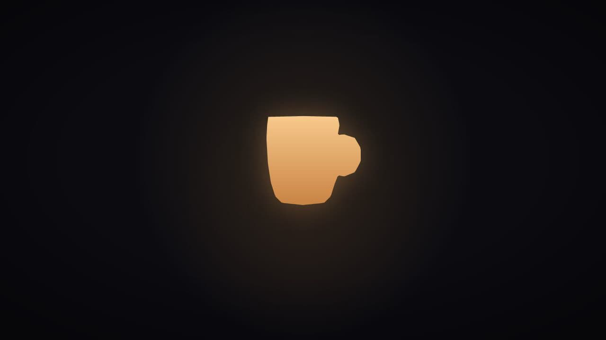</a><br>**形变** `morph`<br>形状插值变形链 | <a href="samples/liquid-flow-sample.mp4" title="播放液态样片"></a><br>**液态** `liquid-flow`<br>goo 流体与液态融合 |

以上为精选样片；全量 61 卡样片索引见 [samples/all.html](samples/all.html)。历史配方样片（6 秒、无音轨，作配方层参考）：

|  |  |  |
| :---: | :---: | :---: |
| <a href="samples/recipe-explainer-sample.mp4" title="播放讲解片样片">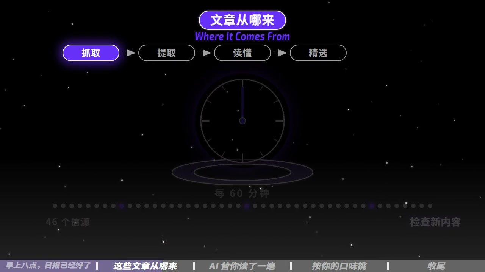</a><br>**讲解片** `explainer`<br>知识讲解与流程轨 | <a href="samples/recipe-promo-sample.mp4" title="播放宣传片样片">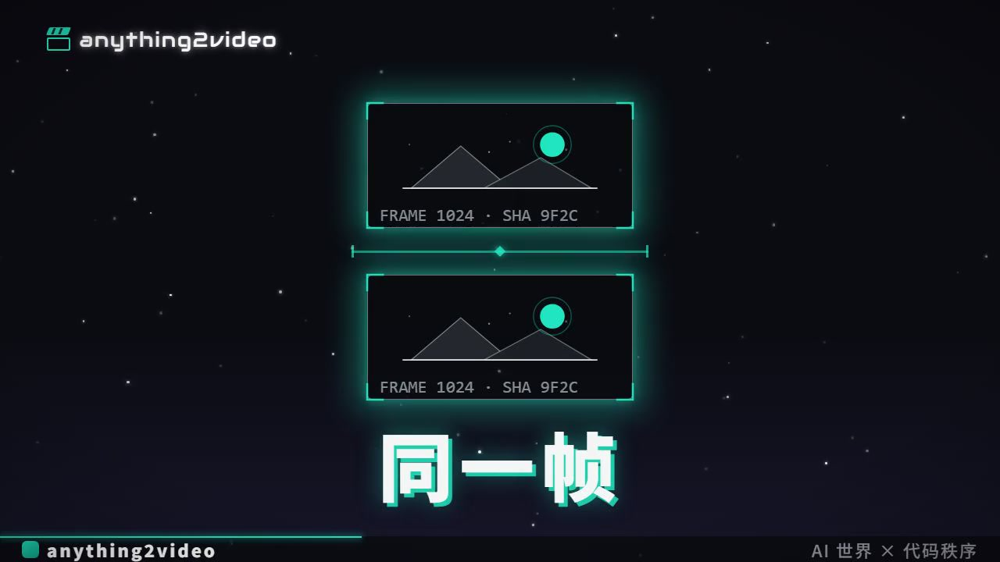</a><br>**宣传片** `promo`<br>功能演示与贯穿线 | <a href="samples/recipe-epic-sample.mp4" title="播放史诗品牌片样片">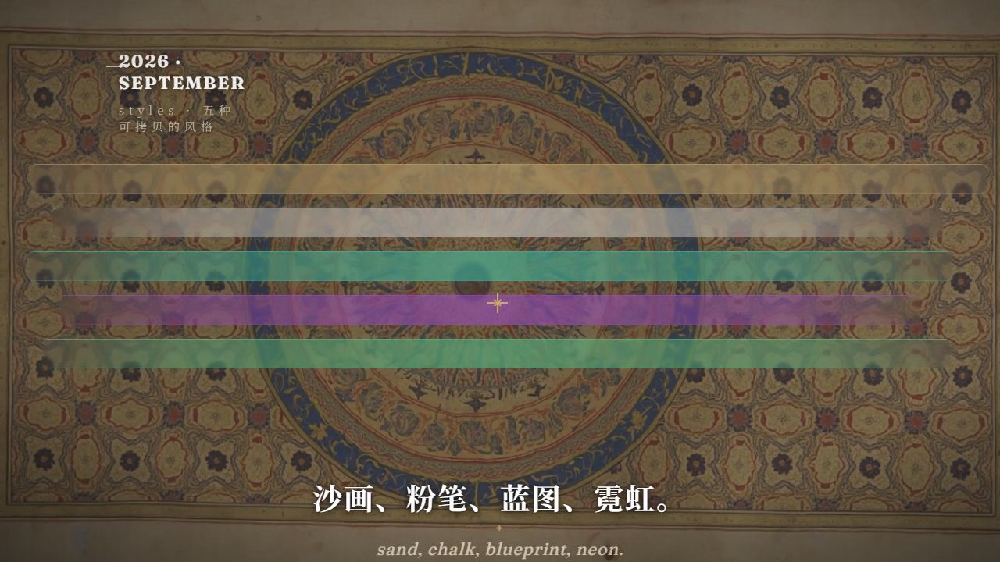</a><br>**史诗品牌片** `epic`<br>AI 生成世界底 + 代码字幕 |

样片不是各宿主当前端到端认证；来源/许可与披露逐段登记在 [samples/README.md](samples/README.md) 与 `samples/manifest.json`。原生竖屏接线见 [portrait-wiring](reference/portrait-wiring.md)。历史代码样片见 [examples](examples/)。这些早期样片不代表全部新配方都纯代码；新片的素材模式以各自MANIFEST为准。

## 生产与验收

```text
调研 → 稿件与真实配音时间轴 → 结构化分镜 → 多点小样
     → 建镜头 → 混音与渲染 → 三轮验收修复 →  measured delivery
```

- `scripts/init.mjs`：安全复制纯模板，无自动git动作。
- `scripts/doctor.mjs`：本地命令检查与图像通道状态（环境三件套 + 首用决定文件，只记 provider、不回显密钥）；不验证账户或云端额度——加 `--probe-image` 可显式做一次真实生成探测（**计一张图费用，默认不跑**），欠费/鉴权失败明确报错并给充值或降级路线。
- `scripts/check-plan.mjs`：连续帧覆盖、空片、来源、文件和素材哈希；还需核对真实镜头注册与渲染。
- `scripts/render.mjs`：跨平台Node渲染，Composition规格与声明必须一致，保存ffprobe原始证据。
- `scripts/check-qc.mjs`：拒绝草稿、片段、未审素材、缺项和旧媒体/源码证据，独立计帧与全片解码；不自动证明艺术质量或实际观看。
- [导演手册](reference/directing-playbook.md) 与 [生产流程](reference/production-workflow.md)：原因/动作/结果、多点打样、根因修复及真实完整审片。
- `gallery/`：157 张镜头动效配方卡（video-shotcraft 移植，Apache-2.0，分镜抽卡用）；`audio-engine/`：mgaudio 程序编曲 vendor（MIT+CC0）与 `scripts/bgm_generate.py` 长片适配层。
- `template/scripts/tts_build.py`：按 project.json 的 slug/fps 生成清洁旁白、时间轴与字幕，同步 totalFrames；旧正本需 --force 才能更新。音频路径逃逸和 config 不一致会拒绝。
- `template/scripts/mix_audio.py`：不可变旁白正本、可复测重混、音乐压低；默认不注入风格音效。
- `template/scripts/mix_sfx.py`：钉帧音效通用通道（cues 表 + sfx-mix.json 台账，混音后第三步，防双混）。
- 三轮验收后加 D 轮独立评分评审（[jury-review](reference/jury-review.md)）：7 维锚点评分，任一维度 <7 阻塞。
- `probe_av_sync.mjs`：纯旁白首句检查，最终媒体时长另测；不能代表全部字幕逐句对齐。
- `probe_delivery.py`：实际规格，交付说明不手写分辨率。

```powershell
npm run typecheck
node <skill>/scripts/check-plan.mjs <project>
node <skill>/scripts/render.mjs <project> preview 12 <1起开始帧>
node <skill>/scripts/render.mjs <project> video
node <skill>/scripts/check-qc.mjs <project> qc/final.json
```

三轮分别看工程真实性、视觉与教学、反向挑错：第一轮检工程（类型检查、覆盖、素材文件、音画、实际规格与解码），第二轮检教学（能否看懂因果、字幕是否遮挡、动作是否有落点、素材有没有伪影），第三轮从反面挑最弱镜头，复核事实、承诺和修改造成的回归。先渲开场、一个最复杂中段和结尾——开场成立而中段塌掉，是常见失败。小样阶段检查字体、听感、字幕带、动作与转场，再施工全部镜头。真实运动片段必须包含开场、复杂中段与片尾，不能以类型检查或截图集代替整片审片。

最终证据门禁：工程先从draft改为production再重渲全片，真实完整播放和听取后，按生产契约记录八项`qc/final.json`审查，再运行`node <skill>/scripts/check-qc.mjs <project> qc/final.json`。它独立计帧和完整解码，核对媒体/源码/证据哈希；源码或素材变动让旧证据失效。缺少实际检查就保持not_performed，不能自动填写passed。

初始化是 draft。正式前改 project.status 为 production 再重渲。媒体 sidecar 记录媒体/源码全 SHA256 和帧范围，视觉/声音默认 not_performed；实际完整播放与听取后才填 QC。源码、字幕、音频或素材变化都会使旧证据失效。

横屏传统模板1280×720@30；竖屏目标1080×1920@30，需要重新布局和Composition，不是横屏放大。AI生成素材必须披露，发布平台的声明入口仍需使用。不存在"保证过审"规则。

**国内发布**：抖音版本要原生竖屏，关键信息避开右侧操作区与底部介绍区。制作安全区是保守建议，最终以账号发布预览为准。字幕每屏只留能读完的短句，命令太长分段展示。有AI生成画面或合成配音，按当期发布界面启用适用的AI声明，并保留相关标识；成片内的一行"AI辅助制作"不能代替平台按钮。模型对比要把范围写完整：标题可以讲"用anything2video替代某个模型做视频的流程"，不能没有测试就写"所有能力全面碾压"。

## 成本与失败处理

成本来自模型调用、TTS、素材生成、渲染和复核。项目不提供虚构的每条价格；先做一个10到15秒小样，记录调用与渲染耗时，才能估算自己环境的成本。

模型写错代码时，先把失败缩到单个镜头；声音通道不可用时，记录回退原因；素材连续不合格时，重写构图；速度太慢时，先减并发与高成本特效；输出规格不符时，从Composition和配置修起，不在交付说明里改口。所谓稳定，是失败能被发现、结果能被复测、改动能被定位——让这个流程留在工程里，才是Skill比一条漂亮提示词更有价值的地方。

## 回归验证

```powershell
node --test tests/runtime.test.mjs tests/editions.test.mjs tests/qc.test.mjs tests/source-consistency.test.mjs
cd template
uv sync
uv run python -m unittest discover -s tests -v
npm install
npm run typecheck
```

测试覆盖运行时、独立包、证据新鲜性、音频正本、真实错位、章表和生成素材合同，另有真实源一致性门禁（宿主入口版本、包清单、样片哈希、缓存垃圾）。测试证明具体工程行为，不证明审美与跨模型等价。变更与验证范围见 [v3报告](docs/optimization-v3.md)、[v3.1六端扩展](docs/optimization-v3.1.md)、[v3.6](docs/optimization-v3.6.md)、[v3.7](docs/optimization-v3.7.md)、[v3.8](docs/optimization-v3.8.md)、[v3.9](docs/optimization-v3.9.md)、[v3.10](docs/optimization-v3.10.md) 与 [v4.0](docs/optimization-v4.0.md)，历史 [v2报告](docs/optimization-v2.md) 保留。

## 许可与鸣谢

代码与文档 [MIT](LICENSE)。字体分别为SIL OFL，许可随文件分发。早期样例音乐署名见 [examples/README.md](examples/README.md)。新工程音乐与AI素材分别记录，不将独立音乐原文件打包公开分发。参考来源：[Remotion 文档](https://www.remotion.dev/docs/)（代码渲染与帧约定）、[WorkBuddy Skill说明](https://open.workbuddy.cn/docs/skill)与[IDE Skills文档](https://www.workbuddy.cn/docs/ide/Features/Skills)（安装入口参考）、抖音AI标识公告的公开转述（发布时以平台当前规则和界面为准）。

explainer规范与本模板同源于 [anything2explainer](https://github.com/Vincentwei1021/anything2explainer)。参考案例仅用于学习手法；不随包分发他人视频或抽帧。本项目无 Anthropic、平台或其他工具官方合作关系。
